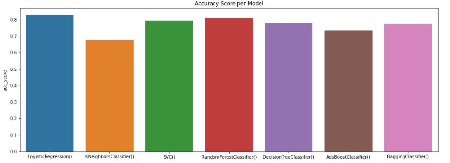
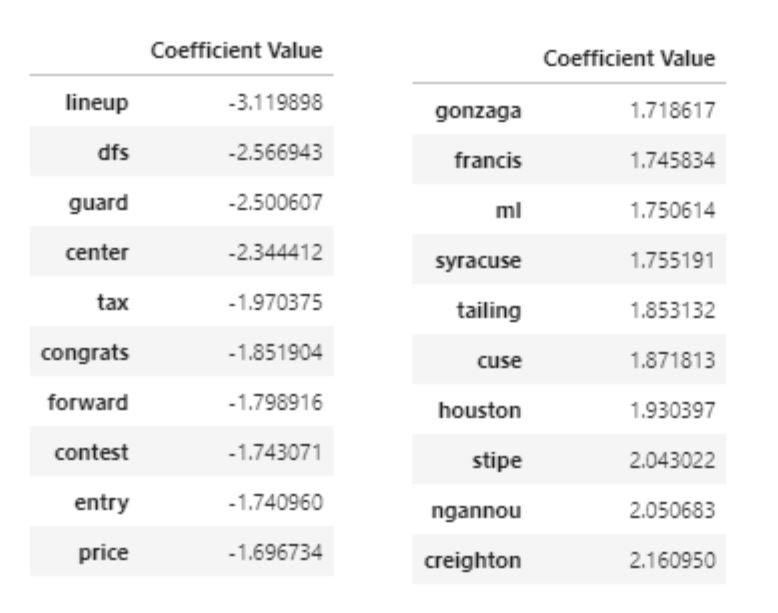
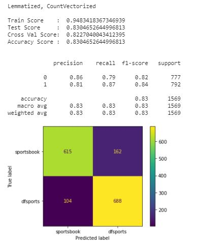

## Project 3: Web APIs & NLP
---
### Table of Contents

- Problem Statement
- Executive Summary
- Conclusion and Recommendations
- File Directory
- Data and Data Dictionary

---

### Problem Statement

This project explores comments collected from Reddit.com to predict what particular subreddit those comments were collected from.   Through this process we can gather some insight on what words to focus on in our predictions.  Once these words are identified they can be used for further analysis.

### Executive Summary

In order to explore comments from Reddit.com, data collect of those comments is needed.  Pushshifts’ API was used to do this on the chosen subreddits of sportsbook and dfsports.  Once the data was collected the normal data science workflow was followed to identify the best way to predict the classification of subreddit based on the comments.

Throughout the data science workflow it was determined that logistic regression was the best model at predicting the subreddit based on the comments.  This model was chosen by comparing its performance across other models such as decision tree classifier and random forest classifier.  Once the data was cleaned the figure 1 below shows each model's performance by accuracy score.

 
Figure 1

The next step in the process was to use a pipeline to test different hyperparameters for the chosen transformers and classifier.  To combat over fitness of the base model penalty and C value were introduced along with others.  The best model to come out of the pipeline shows us a decreased C value, which helps us increase regularization and reduce overfitting.  The model also tells us that this comes at a cost; with a decrease in accuracy.  To help our model in both accuracy and over fitness more cleaning would need to be performed.  There are words that are bogging down the model, so another run at taking out unnecessary words and adding more stop words would be a solution to this problem.

Once this model is chosen as the best classifier we can really dive into the data provided by the model to gather insights on words to focus on.  Figure 2, below, shows the top 10 words for each subreddit and their coefficient values.  The greater the coefficient value, furthest from zero, the more it was used to determine the subreddit.

 
Figure 2

Now that we have the top words for each subreddit we can use them for further analysis.  For example, just by examining the words at eye level you can see that dfsports commenters are more congratulatory than sportsbook commenters.  A deeper dive into these words would be to analyze their sentiment.  This could provide useful information in a business case to create a target for ads or promotions.

---

### Conclusion and Recommendations

The final model provided from the pipeline gave us an accuracy score of .80, which is better than the baseline of .50.  This is not the best model but by reducing the C value and adding a penalty we were able to combat the over fitness of the base model.  As a recommendation, to help our model in both accuracy and over fitness more cleaning would need to be performed.  There are words that are bogging down the model, so another run at taking out unnecessary words and adding more stop words would be a solution to this problem.  Another solution could be adding more data, using more comments from another point in time. Figure 3 shows the scores of the models performance, below.

 
Figure 3

Still with this model we can dive into the data provided to gather insights on words to focus on.  Figure 2, above, shows the top 10 words for each subreddit and their coefficient values.  The greater the coefficient value, furthest from zero, the more it was used to determine the subreddit.  

These top words for each subreddit we can use them for further analysis.  For example, words like “congrats” having a fairly high coefficient value of -1.85, when compared to others, we can see that commenters on dfsports are more congratulatory than those of sportsbook.  Another word that helps us draw this conclusion is “tax”, why would someone mention tax in this subreddit.  The word “tax” is used because dfsports talks openly about winnings.  That is why you see “congrats” and “tax” with strong value; commenters are providing each other with praise and advice about their winnings. 

Another insight we can draw about the dfsports words is in reference to words like “lineup, guard, center and forward”.  These words are mentions of positions in the sport of basketball, which shows us that commenters are posting about line ups and advice about lineups.  

As for sportsbook the words are specific to what is being bet on.  For example, “stipe, ngannou, francis” are names of UFC fighters.  At the time this data was pulled Stipe vs Ngannou UFC fight was about to or just took place.  We can see this too with “gonzaga, syracuse, creighton”, which are colleges in the United states.  Again at the time the data was pulled the NCAA men’s basketball tournament was being played.  With these insights we can conclude that sportsbook commenters are posting more about their own bets.  

All in all the conclusion can be made that if one was seeking help online about daily fantasy sports dfsports would be a great source of advice and support.  If one was looking for advice or support on straight bets, sportsbook would not be a good source for either.

---

### File Directory

#### Folders/Files

* Code: 
    * 01_Scrapping_Posts_Attempt - basic attempt at using Pushshift's API
    * 02_reddit_api_automation_combination - function built to use Pushshift's API to pull large amounts of comments given a subreddit
    * 02_reddit_api_automation_for_cmd.py - previous file converted to .py to be ran in CLI
    * 03_EDA_FirstRun - initial attempt of EDA and familiarization with data 
    * 03a_EDA_stopwords_lemmatizer_stem - uses csv file created from first run, to create csv of stemmed and lemmatized words
    * 04_Modeling - first run at model, used Countvectorizer and logistic regression with interpertation
    * 04_Modeling_CSW_Stem_Lem - modeling with csv created in, 03a_EDA_stopwords_lemmatizer_stem, using logistic regression with interpertation
    * 04b_Modeling_Gridsearch - using best transformer from 04_Modeling_CSW_Stem_Lem, to model across multiple classifiers
    * customstopwords.py - lists of custom stop words created in 03a_EDA_stopwords_lemmatizer_stem, converted to .py for simple import to modeling notebooks
* CommentFiles:
    * reddit_comments - fist file created from 
    * reddit_comments_final - final comments file, combination of each reddit_comment file
    * Comments_EDA_Final - final file of comments after inital EDA
    * Comments_EDA_lem - final file of comments after 03a_EDA_stopwords_lemmatizer_stem, for just lemmatized words
    * Comments_EDA_stem - final file of comments after 03a_EDA_stopwords_lemmatizer_stem, for just stemmed words
* Extras - Collection of extra notebooks and files not used for conclusive modeling.
* Images - Contains images used in readme.md
* Slides - Contains presentation pdf

---

### Data and Data Dictionary

Data collected using [Pushshift's](https://github.com/pushshift/api).  All comments were collected and consolidated in the CommentsFiles folders.

|Feature|Type|Dataset|Description|
|---|---|---|---|
|subreddit| Object | reddit_comments_final |Title of subreddit.| 
|body| Object | reddit_comments_final |The complete text of comment.|  
|created_utc| Int64 | reddit_comments_final | Time comment was posted as an epoch value. |
|author| Object | reddit_comments_final | Reddit username of commenter.|
|submission_title | Object | reddit_comments_final |The submission title pulled from the permalink.|

---
---